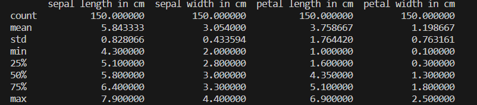
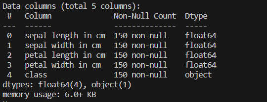
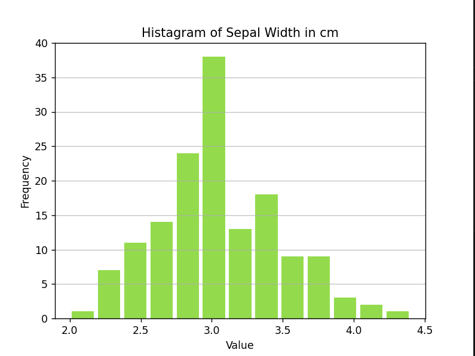
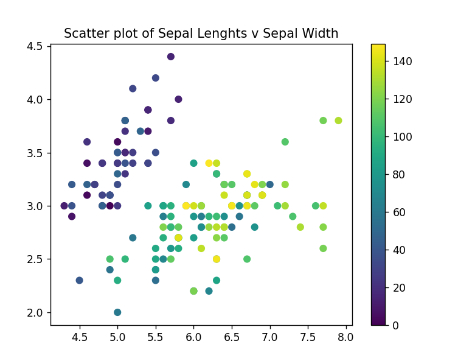
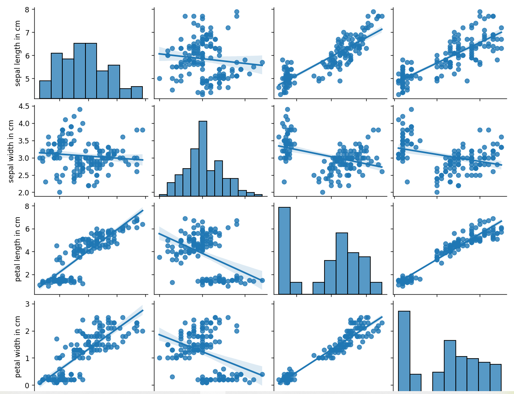

# pands-project
Final assignment for Programming and Scripting module. The module presents introduction to solving problems using programming language Python.
___
The Data was extracted from Fisher's Irish data set. The Famous database from Fisher, 1936. The data set consists of 50 sampels of three Iris species: Iris-setosa, Iris-versicolor and Iris-virginica.


___

### Description about database
* The Iris Data set has 150 rows and 5 colums. 
* The data has two dimension.
* No missing data in this dataset.
* The first column represented sepal length, the second column represented sepal width, the third column represented petal length, and the fourth column represented petal width.
* The data was imported from csv file.
___
# Exploring Iris Dataset

The graet metod to explore statiscic summary of Irish dataset is describele() function. This function produces for each columne some statisctic data such a mean, median, std, max, min, quartiles.

Statiscic Summary:
The describe()metod in Python returns numerical data for each column:
* count: the number of not-empty values
* mean: the average value
* std: the standard deviation
* min: the minimum value
* 25% :the 25% percentile 
* 50% :the 50% percentile 
* 75% :the 75% percentile 
* max : the maximum value


* There are 50 observation
* The columns shows measurments of sepal length, sepal width, petal length and pental width 
* The greatest average value has sepal lenght 5.84 
* The longest sepla is 7.9 cm and the smallest 4.30 cm 
* The longest petal is 6.90 cm and the smallest 0.1cm
* The highest standard deviation has petal lengths is 1.76 and the lowest sepal width 0.43
___
The head() metod in Python presents a specific number of top ten rows.

 
___
The info()methods diplay information about the Iris dataset. The method prints: 
* number of columns
* columns labels
* columns data types 
* memory usage
* the number of cells in each column 

 

 Only one columns has categorical data and all columns are the numeric type with non-Null. 
___
### Data Visualisation
We can use various of data visualization modules to presents data, using Python libraries.
In this project we use:
* Matplotlib
* Seaborn
 

To plot the histagram, we import libraries from Matplotlib.
Mataplotlib is a powerful data visualization suite.
For each variable, we plot a histagram showing the distribution of the iris dataset. Histagrams are ideal for showing whether a distribution is symmetrical or left/right skewed.




The histagram of Sepal Width looks rough symmetric. 
___
The Matplotlib has metod to draw scatter plot. The scatter plot show the relationship bettween two variable. 
We display relationship between the Sepal Lenghts and Sepal Width for Iris-setosa, Iris-versicolor and Iris-virginica. 

The syntax used: 

```python
colors = np.arange(150)
plt.scatter(sepal_len, sepal_wid,c=colors, cmap='viridis')
plt.colorbar()
plt.show()
```



Above plot shows: the species Virginica has larger sepal lengths and smallest sepal widths.
Species Setos has smallest sepal lengths.

___

 The Pie plot  was used to obtain the frequency of three species of Iris data.The circular analytic chart hepls undersand the proportion of data. Each of these three categories is represented as a slice of the pie.  


___
The plot pairwise relationship in a dataset. We import the seaborn libraries to create pair plot using pairplot()function. 

The syntax used:
```python
import seaborn as sns 
sns.pairplot (iris_data, kind='reg') 
plt.show()

```




### Source 

### Language 
* Python 
## Important Library 
* math 
* pandas 
* matplotlib. pyplot 
* seaborn

### Technologies 
* Visual Studio Code
* Cmder git

 Reference: 

 * https://towardsdatascience.com/
 * https://dimension-reduction-techniques-with-python-f36ca7009e5c
 * https://www.kaggle.com/code/jchen2186/machine-learning-with-iris-dataset
 * https://www.geeksforgeeks.org/python-basics-of-pandas-using-iris-dataset/
 * https://www.pycodemates.com/2022/05/
 * iris-dataset-classification-with-python.html?utm_content=cmp-true
 * https://www.youtube.com/watch?v=02BFXhPQWHQ
 * https://www.webucator.com/article/python-color-constants-module/
 * https://pythonspot.com/matplotlib-histogram/
 * https://stackoverflow.com/questions/39841733/
 * matplotlib-histogram-how-to-display-the-count-over-the-bar
 * https://nakazakimasahito.wordpress.com/2021/01/26/
 * plotting-a-histogram-of-iris-data/
 * https://www.geeksforgeeks.org/python-basics-of-pandas-using-iris-dataset/
 * https://datagy.io/seaborn-pairplot/
 * https://stackoverflow.com/questions/54317168/
 * plotting-a-dataframe-with-seaborn-pairplot-in-multiple-colors
 * https://python-charts.com/correlation/pairs-plot-seaborn/