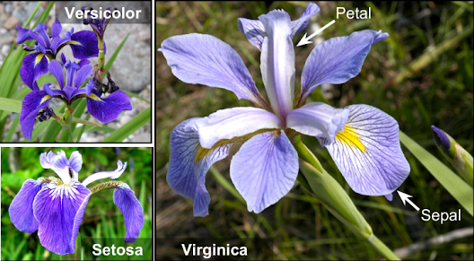

# pands-project

___
The Data was extracted from Fisher's Irish data set. The Famous database from Fisher, 1936

___

### Description about database
The Iris Data set has 150 rows and 5 colums. 
No missing data in this dataset
The first column represented sepal length, the second column represented sepal width, the third column represented petal length, and the fourth column represented petal width

### Source 

### Language 
* Python 
## Important Library 
* math 
* pandas 
* matplotlib. pyplot 

### # Reference: 
 https://towardsdatascience.com/dimension-reduction-techniques-with-python-f36ca7009e5c
 https://www.kaggle.com/code/jchen2186/machine-learning-with-iris-dataset
 https://www.geeksforgeeks.org/python-basics-of-pandas-using-iris-dataset/